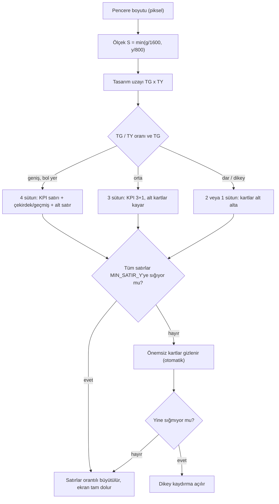
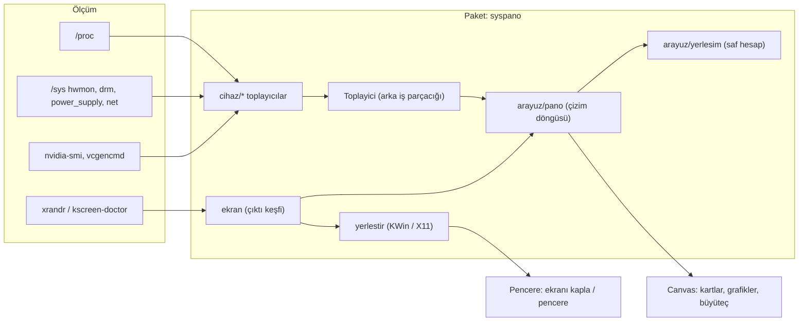

# SysPano — Linux Sistem ve Kaynak İzleme Panosu

> **English:** SysPano is a device-independent Linux system & resource monitor
> (CPU, memory, temperature, fan, battery, GPU, disk, network, processes) built
> on Python 3 + tkinter only. It runs on a desktop monitor, a secondary small
> panel (e.g. ASUS ScreenPad) or a Raspberry Pi touchscreen, and adapts itself
> to the screen size, resolution and aspect ratio: the layout picks 1–4
> columns, hides cards that do not fit and enables scrolling when needed.
> No network access and no third-party runtime dependency. Install with
> `./install.sh` or `pip install .`, then run `syspano`.

CPU, bellek, sıcaklık, fan, pil, GPU, disk, ağ ve süreçleri tek bir pencerede
gösteren, **cihazdan bağımsız** bir Linux panosu. Sıradan bir masaüstü
monitöründe de, dizüstünün ikincil küçük ekranında da (ASUS ScreenPad gibi),
Raspberry Pi'nin dokunmatik panelinde de çalışır: ekran boyutunu, çözünürlüğü ve
en-boy oranını kendisi algılar.

* **Sıfır ağ bağımlılığı**: tüm veriler `/proc` ve `/sys`'den okunur.
* **Sıfır zorunlu bağımlılık**: yalnızca Python 3 + tkinter yeter (Raspberry Pi OS
  dâhil her dağıtımda hazır gelir).
* **Donanımı körlemesine varsaymaz**: Intel/AMD/NVIDIA/VideoCore GPU, her marka
  sıcaklık sensörü, pil, fan, diski ve ağ arayüzünü çalışma anında bulur;
  bulamadığı kartı gizler, panonun kalanı çalışmaya devam eder.


## Neleri gösteriyor

| Kart | İçerik |
|---|---|
| **CPU** | Toplam kullanım, ortalama GHz, çekirdek sayısı, yük ortalaması, 4 dakikalık grafik |
| **BELLEK** | Kullanılan/toplam GiB, takas (zram), grafik |
| **SICAKLIK / FAN** | İşlemci paketi °C, en sıcak çekirdek, fan RPM, NVMe/PCH/Wi-Fi sıcaklıkları, grafik |
| **PİL** | Yüzde, durum, güç (W), sağlık, kalan süre, grafik — *pil yoksa gizlenir* |
| **ÇEKİRDEK KULLANIMI** | Her mantıksal çekirdeğin yüzdesi ve anlık frekansı |
| **GEÇMİŞ** | CPU, bellek ve sıcaklık eğrileri (son 4 dakika) |
| **GPU** | Intel (RC6 ile meşguliyet), AMD (`gpu_busy_percent`), NVIDIA (gerçek durum: kullanılıyor / yeni kullanıldı / boşta, VRAM, pstate, süreç) ve Raspberry Pi VideoCore |
| **DİSK / AĞ** | Kök disk okuma/yazma MB/sn, doluluk, varsayılan arayüz, ↓/↑ KB/sn, yerel IP |
| **SÜREÇLER** | En çok CPU kullanan 10 süreç |
| **YEDEK** | Google Drive (gdrive-yedek) durumu — *kurulu değilse gizlenir* |
| **SİSTEM** | Ana makine adı, dağıtım, çekirdek, mimari, çalışma süresi, oturum tipi |

Veriler varsayılan olarak **1 saniyede bir** okunur; aralık `--aralik` ile
değiştirilir. Gömülü bir **terminal** sekmesi de vardır (`⌨ Terminal` düğmesi).

## Donanım desteği

| Bileşen | Desteklenen kaynaklar |
|---|---|
| İşlemci | `coretemp` (Intel), `k10temp`/`zenpower` (AMD), `cpu_thermal`/`soc_thermal` (ARM, Raspberry Pi), `acpitz`, `/sys/class/thermal` yedeği |
| GPU | Intel i915 (RC6 sayacı), AMD amdgpu (`gpu_busy_percent`), NVIDIA `nvidia-smi`, VideoCore (`vcgencmd`), `devfreq` yedeği |
| Pil | Herhangi bir `power_supply` düğümü (`BAT0`, `BAT1`, `CMB0`…), `charge_*` ya da `energy_*` biçimi; şebeke `Mains` tipinden |
| Fan | `asus`, `thinkpad`, `nct6775`, `it87`, `dell_smm`, `applesmc`… veya ilk pozitif fan girişi |
| Disk | Kök dosya sisteminin diski (`/proc/self/mountinfo`), NVMe/SSD/MMC/eMMC |
| Ağ | IPv4 varsayılan yolu; kablo, Wi-Fi (sinyal gücü), hız |
| Ekran | X11 ve Xwayland (xrandr), KDE mantıksal uzayı (kscreen-doctor), wlroots (wlr-randr), sway |

> [!NOTE]
> Tkinter X11 üzerinde çalışır. Wayland oturumlarında **Xwayland** paketinin
> kurulu olması gerekir (Raspberry Pi OS Bookworm'da vardır). KDE dışındaki
> ortamlarda pencere yöneticisiz açılır: çerçevesiz, doğru konumda, en üstte —
> ama bazı masaüstleri böyle pencerelere klavye odağı vermez; gömülü terminali
> kullanacaksanız KDE ya da `--mod pencere` önerilir.

## Kurulum

### 1. Kurulum gerekmeden (depodan)

```bash
git clone https://github.com/kullanici/syspano.git
cd syspano
./run.sh                 # panoyu aç
./run.sh --liste-ekranlar
./run.sh test            # yerleşim testleri
```

### 2. Kurulum betiğiyle (önerilen)

```bash
./install.sh                  # venv'e kurar + oturum açılışında başlatır
./install.sh --no-autostart    # otomatik başlatmayı kurmadan
./install.sh --service         # systemd kullanıcı servisi de kurar
./install.sh --kaldir          # kaldırır
```

Betik dağıtımı algılar (apt/dnf/pacman/zypper), eksikse `python3-tk`'yı kurar,
paketi `pipx` varsa onunla yoksa `~/.local/share/syspano/venv` içine kurar ve
`~/.local/bin/syspano` başlatıcısını yazar.

### 3. pip ile

```bash
pip install .            # ya da: pipx install .
syspano
```

Tepsi simgesi (isteğe bağlı) için PySide6: `pip install "syspano[tepsi]"`.

## Kullanım

```bash
syspano                          # hedef ekranı otomatik seç, ekranı kapla
syspano --liste-ekranlar          # bağlı ekranları listele
syspano --ekran HDMI-A-1          # belirli ekranda aç
syspano --ekran ana               # birincil ekranda aç
syspano --ekran tumu              # tüm masaüstünü kapla
syspano --mod pencere --pencere 1280x720
syspano --olcek 1.4               # yazıları ve kartları büyüt
syspano --kartlar cpu,bellek,gpu  # yalnızca seçili kartlar
syspano --tema acik
syspano --terminal-yok --tepsi-yok
syspano --test                    # 9 saniye sonra kapanır (deneme)
```

### Yararlı seçenekler

| Seçenek | Açıklama |
|---|---|
| `--ekran auto` | Tek ikincil ekran varsa onu seçer, yoksa birincil ekranı |
| `--mod ekran` | Hedef ekranı tamamen kaplar (varsayılan) |
| `--mod pencere` | Verilen boyutta normal pencere (`--pencere GxY`) |
| `--olcek K` | Ölçek katsayısı; 1.0 varsayılan, yazılar küçükse artırın |
| `--kart-ekle` / `--kart-cikar` | Kart listesini düzenler |
| `--otomatik-kart` | Yer yetmezse önemsiz kartları gizler (varsayılan) |
| `--kartlari-koru` | Hiçbir kartı gizlemez, gerekirse kaydırma sunar |
| `--yapilandir` | Verilen seçenekleri yapılandırma dosyasına yazar |

### Yapılandırma

`~/.config/syspano/config.json` (komut satırı her zaman bunu geçersiz kılar):

```json
{
  "ekran": "auto",
  "mod": "ekran",
  "pencere": [1280, 720],
  "olcek": null,
  "tema": "koyu",
  "kartlar": ["cpu", "bellek", "sicaklik", "pil", "cekirdek", "gecmis",
              "gpu", "disk_ag", "surecler", "yedek", "sistem"],
  "buyutec": true,
  "terminal": true,
  "tepsi": true,
  "guncelleme_ms": 1000
}
```

`olcek: null` → ölçek ekran boyutundan otomatik hesaplanır. Yüksek yoğunluklu
küçük bir panelde (ör. 2160×1080, 5,9") yazılar hâlâ küçük görünüyorsa
`"olcek": 2.0` gibi bir değer verin veya `--olcek 2.0` kullanın.

## Farklı ekran boyutlarına uyum

Pano sabit bir çözünürlüğe göre çizilmez. Ölçek, pencere boyutundan türetilir
(tasarım uzayı yaklaşık en az 1600×800 kalacak şekilde) ve yerleşim motoru kaç
sütun sığacağını **en-boy oranından** hesaplar; artan/eksik yer satır
yüksekliklerine orantılı dağıtılır. Sığmayan kartlar önem sırasına göre
gizlenir, hiç sığmazsa dikey kaydırma devreye girer.



Örnek eşlemeler:

| Cihaz | Çözünürlük | Ölçek | Tasarım uzayı | Sütun | Sonuç |
|---|---|---|---|---|---|
| ASUS ScreenPad | 2160×1080 | 1,35 | 1600×800 | 4 | Tüm kartlar |
| 4K monitör | 3840×2160 | 2,40 | 1600×900 | 4 | Tüm kartlar, büyük yazı |
| Full HD monitör | 1920×1080 | 1,20 | 1600×900 | 4 | Tüm kartlar |
| Raspberry Pi 7" | 800×480 | 0,90 | 889×533 | 2 | Altı kart, sıkı düzen |
| 3,5" panel | 480×320 | 0,90 | 533×356 | 1 | Yalnız CPU + bellek |
| Dikey ekran | 1080×1920 | 0,90 | 1200×2133 | 3 | Tüm kartlar, uzun liste |

### Büyüteç

Yüksek yoğunluklu küçük panellerde (ör. 390+ PPI) yazı fiziksel olarak
küçüktür. İmleç panonun üzerinde **0,4 saniye durduğunda** altında yuvarlak bir
büyüteç belirir ve içeriği 2,6 kat büyütür; kırpma sayesinde daire dışındaki
öğeler hiç çizilmez, bu yüzden maliyeti yoktur. Kapatmak için `--buyutec-yok`.

## Mimari



Ayrıntılar:

* `cihaz/` — her sensör ailesi ayrı bir modül; hepsi `oku(d, ayar)` imzasını
  taşır ve veri yoksa `{"yok": True}` döndürüp kartı gizler.
* `arayuz/yerlesim.py` — **Tk kullanmayan saf hesap**; bu yüzden her ekran
  boyutu için birim testiyle doğrulanabilir.
* `yerlestir.py` — KDE'de KWin betiğiyle geometri (görev çubuğunda gösterme,
  çerçevesiz, üstte), diğer ortamlarda yöneticisiz pencere + `geometry`.
  Geometri KWin'in *mantıksal* uzayında, pencere boyutu X11 uzayında verilir
  (kesirli ölçeklemede ikisi farklıdır).
* `Toplayici` — tek arka iş parçacığı; arayüz kilit altında son veriyi okur.

## Terminal sekmesi (isteğe bağlı)

`⌨ Terminal` düğmesi panonun yerine gömülü bir kabuk açar (ayrı uygulama
değildir). `Ctrl +`, `Ctrl −`, `Ctrl 0` yazı boyutunu değiştirir; fare tekerleği
geçmişi kaydırır. `--terminal-yok` ile kapatılır.

## Tepsi simgesi (isteğe bağlı)

PySide6 kuruluysa panoyu yöneten küçük bir tepsi simgesi açılır: göster/gizle,
görünüm, yazı boyutu, çıkış ve ipucu metninde anlık CPU/sıcaklık/pil. Kurulu
değilse sessizce atlanır (`--tepsi-yok`).

## Geliştirme

```bash
./run.sh test                        # yerleşim testleri (Tk gerekmez)
PYTHONPATH=src python3 -m pytest -q  # pytest varsa
./run.sh --test                      # panoyu 9 sn aç, kapanır
```

Yerleşim testleri 14 farklı çözünürlük/en-boy oranını dener: kartlar ekran
içinde mi, aynı satırdakiler çakışıyor mu, sütun sınırı aşılıyor mu, içerik
verilen yüksekliğe sığıyor mu.

## Sorun giderme

| Belirti | Çözüm |
|---|---|
| `DISPLAY tanımlı değil` | Grafik oturumunda çalıştırın; Wayland'de Xwayland kurun (`xorg-xwayland`) |
| Pencere yanlış ekranda | `syspano --liste-ekranlar` ile adı bulun, `--ekran AD` verin |
| Yazılar çok küçük/büyük | `--olcek 1.5` (küçükse artırın) ya da yapılandırmada `"olcek"` |
| Boşta kart eksik | O donanım yok ya da sensör okunamıyor; `--kartlari-listele` ile bakın |
| Tüm kartlar sığmıyor | `--kart-cikar yedek,surecler` ya da `--olcek` düşürün |
| Terminale yazı gitmiyor | KDE dışındaysa `--mod pencere` kullanın (odak sorunu) |
| KDE'de görev çubuğunda görünüyor | Pencere tipi/`SKIP_TASKBAR` bekçisi çalışır; `xprop` ile denetleyin |

## Ekranın kilidi açılmadan önce

Oturum açılışında başlatmak için `./install.sh` çalıştırmanız yeterlidir;
oluşturduğu `~/.config/autostart/syspano.desktop` dosyasını düzenleyebilirsiniz.
Ekran düzeni geç yükleniyorsa `Exec` satırına bir gecikme ekleyin:
`Exec=sh -c 'sleep 8; syspano --ekran HDMI-A-1'`.

## İlgili projeler

* **gdrive-yedek** — panonun **YEDEK** kartının okuduğu Google Drive yedek
  durumu (`~/.local/state/gdrive-yedek/durum.json`). Yol
  `yedek_durum_yolu` ile değiştirilebilir; proje kurulu değilse kart gizlenir.
* **ScreenPad panosu** — bu projenin öncülü: ASUS ScreenPad'e özel, KWin ve
  Intel/NVIDIA'ya sabitlenmiş sürüm. SysPano aynı mantığı cihazdan bağımsız
  hâle getirir.

## Lisans

MIT — `LICENSE` dosyasına bakın.
