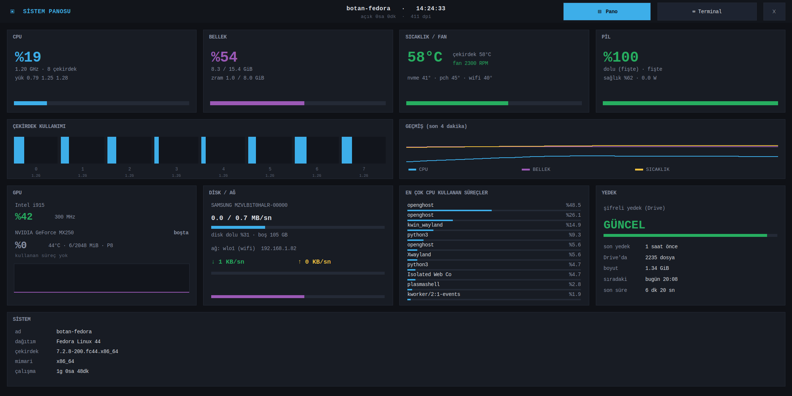
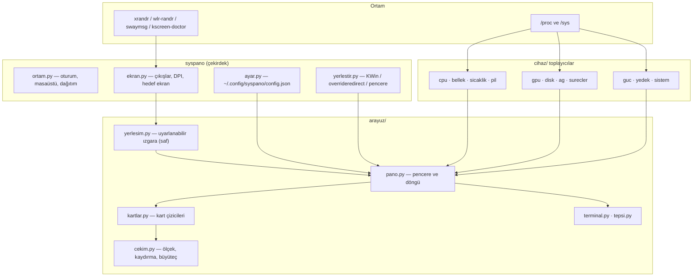

# SysPano — Linux Sistem ve Kaynak İzleme Panosu

CPU, bellek, sıcaklık, fan, pil, GPU, disk, ağ ve süreçleri tek bakışta gösteren
bir Linux panosu. **Her ekran boyutuna ve çözünürlüğe uyum sağlar**: 4K bir
monitörde 4 sütunlu tam pano, bir Raspberry Pi dokunmatik panelinde 2 sütunlu
kompakt pano, küçük bir ikincil ekranda ise yalnızca en önemli kartlar.

Tkinter ile çizilir: **harici Python bağımlılığı yoktur**, her şey `/proc` ve
`/sys`'den okunur. Kurulum tek betikle yapılır; Ubuntu, Debian, Fedora, Arch ve
Raspberry Pi OS üzerinde çalışır.



## Neleri gösteriyor

| Kart | İçerik |
|---|---|
| **CPU** | Toplam kullanım, ortalama GHz, çekirdek sayısı, yük ortalaması, 4 dakikalık grafik |
| **BELLEK** | Kullanılan/toplam GiB, takas (zram) kullanımı, grafik |
| **SICAKLIK / FAN** | İşlemci paketi °C, en sıcak çekirdek, fan RPM, NVMe/PCH/Wi-Fi sıcaklıkları |
| **PİL** | Yüzde, durum (şarj/boşalma/fişte), güç (W), sağlık, kalan süre |
| **ÇEKİRDEK KULLANIMI** | Her mantıksal çekirdeğin yüzdesi ve anlık frekansı |
| **GEÇMİŞ** | CPU, bellek ve sıcaklık eğrileri (son 4 dakika) |
| **GPU** | Intel (RC6), AMD (`gpu_busy_percent`), NVIDIA (`nvidia-smi`) ve Raspberry Pi VideoCore |
| **DİSK / AĞ** | Kök disk okuma/yazma, doluluk, ağ arayüzü, IP, ↓/↑ hızı |
| **SÜREÇLER** | En çok CPU kullanan süreçler |
| **YEDEK** | *(isteğe bağlı)* gdrive-yedek durumu: son yedek, dosya sayısı, boyut, sıradaki çalışma |
| **SİSTEM** | Ana makine adı, dağıtım, çekirdek, mimari, çalışma süresi, oturum |

Veriler 1 saniyede bir okunur. Gömülü bir **terminal** (⌨ düğmesi) ve isteğe
bağlı bir **tepsi simgesi** vardır.

## Desteklenen cihazlar

SysPano donanımı tahmin etmez, **ne varsa onu bulur** ve olmayan kartı gizler:

| Bileşen | Nasıl bulunur |
|---|---|
| İşlemci sıcaklığı | `coretemp` (Intel), `k10temp`/`zenpower` (AMD), `cpu_thermal` (ARM/RPi), `acpitz`, `/sys/class/thermal` |
| Fan | `asus`, `thinkpad`, `nct67xx`, `it87`, `dell_smm` … ya da ilk sıfırdan büyük `fan*_input` |
| Pil | `type=Battery` olan herhangi bir güç kaynağı (`BAT0`, `CMB0`, …) |
| GPU | Intel `gt_cur_freq_mhz` + RC6, AMD `gpu_busy_percent`, NVIDIA `nvidia-smi`, RPi `vcgencmd` |
| Disk | Kök dosya sisteminin gerçek diski (NVMe/SSD/MMC, btrfs dahil) |
| Ağ | IPv4 varsayılan yolu; Wi-Fi/Ethernet, sinyal gücü |
| Güç limiti | Intel/AMD RAPL (PL1/PL2), `platform_profile`, CPU governor |

## Kurulum

Üç yol var; hangisi işinize uyarsa onu kullanın.

### 1. Tek komutla (önerilen)

```bash
git clone https://github.com/ornek/syspano.git
cd syspano
./install.sh
```

`install.sh` şunları yapar: tkinter'ı denetler, paketi pipx ya da
`pip install --user` ile kurar ve oturum açılışı girdisi ekler.

```bash
./install.sh --paket       # eksik sistem paketini kendisi kurmayı dener (sudo)
./install.sh --servis      # oturum açılışı yerine systemd kullanıcı servisi
./install.sh --sistem      # sistem geneline kur (sudo)
./install.sh --autostart-yok
```

### 2. Elle

```bash
# tkinter (arayüz için zorunlu)
sudo apt install python3-tk        # Debian / Ubuntu / Raspberry Pi OS
sudo dnf install python3-tkinter   # Fedora / RHEL
sudo pacman -S tk                  # Arch

# SysPano
pipx install .                     # ya da:  pip install --user .
```

### 3. Kurulumdan çalıştırma

```bash
./run.sh                 # depodan doğrudan çalıştır
./run.sh --pencere 1200x700
./run.sh test            # tüm testleri çalıştır
```

### Raspberry Pi OS notu

Pi OS (Bookworm) varsayılan olarak Wayland + labwc kullanır. Tkinter **X11**
ister; Xwayland kuruluysa sorun yaşanmaz:

```bash
sudo apt install xwayland
./install.sh --paket
```

Xwayland yoksa ya da pencere yerleştirmede sorun olursa X11 oturumuna geçin
(`sudo raspi-config` → Advanced Options → Wayland → X11).

## Kullanım

```bash
syspano                          # hedef ekranı otomatik seç (ikincil panel varsa o)
syspano --ekran HDMI-A-1         # belirli bir çıkışı kapla
syspano --ekran ana              # birincil ekranı kapla
syspano --ekran tumu             # tüm masaüstünü kapla
syspano --pencere 1200x700       # pencere modunda çalıştır
syspano --olcek 1.4              # ölçeği elle ayarla (DPI otomatiğini ezer)
syspano --tema acik              # açık tema
syspano --kartlar cpu,bellek,gpu # yalnızca bu kartlar
syspano --liste-ekranlar         # bağlı ekranları listele ve çık
syspano --yapilandir             # varsayılan yapılandırma dosyasını oluştur
```

| Seçenek | Açıklama |
|---|---|
| `-e, --ekran AD` | `auto`, `ana`, `tumu`, çıkış adı (`HDMI-A-1`) veya sıra numarası |
| `-m, --mod MOD` | `ekran` (varsayılan), `pencere`, `tam-ekran` |
| `-p, --pencere WxH` | Pencere modu (her masaüstünde çalışır) |
| `--tam-ekran` | Hedef ekranı çerçevesiz kapla |
| `-o, --olcek F` | Sabit ölçek katsayısı (0,7 – 3,0) |
| `--tema koyu\|acik` | Renk teması |
| `--kartlar a,b,c` | Gösterilecek kartları baştan belirle |
| `--kart-ekle` / `--kart-cikar` | Listeye kart ekle / çıkar |
| `--kartlari-koru` | Kart gizleme; gerekirse kaydır (`--otomatik-kart` tersi) |
| `--yonetilen` | Yöneticisiz pencere yerine normal pencere kullan |
| `--aralik MS` | Güncelleme aralığı (varsayılan 1000 ms) |
| `--terminal-yok` / `--buyutec-yok` / `--tepsi-yok` | İlgili özelliği kapat |
| `--test [SANIYE]` | Test modu: belirtilen süre sonra kapanır |
| `--liste-ekranlar` | Bağlı ekranları listele ve çık |
| `--kartlari-listele` | Kullanılabilir kartları listele ve çık |
| `--yapilandir` | Varsayılan yapılandırma dosyasını oluştur |
| `--varsayilan-yapilandirma` | Varsayılanları ekrana yaz (dosyaya dokunmaz) |

### Klavye ve fare

| Girdi | İşlev |
|---|---|
| ⌤ üst şeritteki düğmeler | Pano ↔ Terminal ↔ Kapat |
| Fare tekerleği / sürükleme | Panoyu dikey kaydır (içerik ekrana sığmıyorsa) |
| `Ctrl +` / `Ctrl −` / `Ctrl 0` | Terminal yazı boyutu |
| İmleci durdurmak | Büyüteç: imlecin altındaki bölge 2,6× büyür |

## Yapılandırma

Yapılandırma dosyası: `~/.config/syspano/config.json` (ilk çalıştırmada
otomatik oluşmaz; `syspano --yapilandir` ile oluşturabilirsiniz). Komut satırı
seçenekleri her zaman dosyayı geçersiz kılar.

```json
{
  "ekran": "auto",
  "mod": "ekran",
  "pencere": [1280, 720],
  "olcek": null,
  "tema": "koyu",
  "kartlar": ["cpu", "bellek", "sicaklik", "pil", "cekirdek",
              "gecmis", "gpu", "disk_ag", "surecler", "yedek", "sistem"],
  "buyutec": true,
  "terminal": true,
  "terminal_yazi": null,
  "tepsi": true,
  "guncelleme_ms": 1000,
  "yedek_durum_yolu": "~/.local/state/gdrive-yedek/durum.json",
  "yedek_zamanlayici": "yedek.timer"
}
```

## Uyarlanabilirlik nasıl çalışır

### 1. Ölçek (S) — DPI'dan

Ekranın milimetre bilgisi (`xrandr`) üzerinden inç başına piksel hesaplanır ve
`S = DPI / 96` alınır. Yani yazı ve çizgiler **fiziksel olarak** her ekranda
benzer büyüklükte görünür: 92 dpi bir monitörde 1×, 213 dpi bir dizüstü
panelinde ~2,2×, 411 dpi bir mikro panelde 3×.

Tasarım uzayı pencereden türetilir: `tasarım_g = genişlik / S`. Tüm koordinatlar
bu uzaydadır ve çizim sırasında `S` ile çarpılır.

### 2. Sütun sayısı — genişlikten

`bağlantı = genişlik / S` değerine göre 1–4 sütun seçilir:

| Ekran | Çözünürlük | Ölçek | Tasarım | Sütun |
|---|---|---|---|---|
| 24" monitör | 1920×1080 @ 92 dpi | 0,96 | 2003×1126 | 4 |
| Dizüstü paneli | 2592×1458 @ 213 dpi | 2,2 | 1168×657 | 4 |
| İkincil mikro panel | 2160×1080 @ 411 dpi | 3,0 | 720×360 | 2 |
| Raspberry Pi 7" | 800×480 @ 134 dpi | 1,4 | 573×343 | 2 |
| 3,5" küçük panel | 480×320 @ 165 dpi | 1,0 | 480×320 | 1 |

### 3. Kart yükseklikleri — mevcut alandan

Kartların yüksekliği sabit değildir; satırlar mevcut yüksekliği ağırlıklarına
göre paylaşır. Yer yetmezse:

1. Satırlar **eşit** yüksekliğe geçer (küçük ekranda daha çok satır sığar),
2. hâlâ sığmıyorsa **düşük öncelikli kartlar** gizlenir (önce `sistem`, sonra
   `yedek`, `süreçler`, `geçmiş` …; `CPU` ve `BELLEK` her zaman kalır),
3. yine sığmazsa pano **kaydırılabilir** olur (tekerlek/sürükleme).

Veri olmayan kartlar (pil yok, GPU okunamadı, yedek kurulu değil, sıcaklık
sensörü yok) baştan gizlenir; yer diğer kartlara kalır.

### 4. Kart içleri — kendi dikdörtgenlerine

Her kart çizilirken aldığı dikdörtgene uyar: çok alçak bir kartta yalnızca büyük
değer ve çubuk, yüksek bir kartta ek satırlar ve grafik görünür; dar kartta uzun
metinler `…` ile kısaltılır. `tests/test_kartlar.py` bunu otomatik denetler:
her kart, 10 farklı boyutta çizilir ve hiçbir öğe kartın dışına taşamaz.

## Hedef ekran seçimi

```bash
syspano --liste-ekranlar
```
```
  [0] eDP-1        2592x1458+0+0  309x174mm  213 dpi  (birincil)
  [1] HDMI-A-1     2160x1080+220+1458  66x134mm  411 dpi  (ikincil)
```

`auto` önce **birincil olmayan** ekranı arar; tek bir ikincil varsa onu seçer,
birden fazlaysa en küçüğünü. Yani "yan panelde pano" kullanımı için ayar
gerekmez: `syspano`.

## Pencere yerleştirme

Masaüstüne göre farklı yol izlenir; hepsi aynı görünümü verir:

| Ortam | Yöntem |
|---|---|
| KDE (KWin) | KWin betiği: çerçevesiz, görev çubuğunda yok, en üstte; klavye odağı için yönetilen pencere |
| Diğer X11 / Xwayland (GNOME, Xfce, sway, labwc, RPi) | `overrideredirect` pencere: yöneticisiz, tam konum, en üstte |
| `--pencere` | Normal pencere: her yerde çalışır |

> [!NOTE]
> Wayland'de istemciler pencere konumunu seçemez. Tkinter zaten X11/Xwayland
> kullanır, bu yüzden konumlandırma Xwayland'ın sanal ekran koordinatlarında
> yapılır; bu KDE, GNOME ve wlroots oturumlarında çalışır. Saf Wayland'de
> (Xwayland yoksa) Tkinter açılamaz — Xwayland kurun ya da X11 oturumu kullanın.

## Terminal ve tepsi

- **Terminal**: Üst şeritteki ⌨ düğmesi panonun yerini tam ekran bir terminale
  bırakır (PTY + VT100 ayrıştırıcı + Tk Canvas). `Ctrl +/−/0` ve
  `Ctrl + tekerlek` yazı boyutunu ayarlar; boyut `config.json`'a yazılır.
  `vim`, `htop` gibi programlarda gelişmiş kaçış dizileri kusurlu görünebilir.
- **Tepsi** (isteğe bağlı, PySide6): `pip install PySide6`. Görev çubuğunun sağ
  tarafındaki simgeden panoyu gizleyip gösterebilir, görünümü değiştirebilir,
  kaydırabilir ve `Ctrl +/−` ile aynı yazı boyutu menüsünü kullanabilirsiniz.
  Pano ile tepsi **dosya üzerinden** konuşur (`$XDG_RUNTIME_DIR/syspano/`).

## Mimari



| Dosya | Görevi |
|---|---|
| `src/syspano/cli.py` | Komut satırı, ortam denetimi, başlatma |
| `src/syspano/ekran.py` | Çıkışları bulur, DPI hesaplar, hedef ekranı seçer |
| `src/syspano/yerlestir.py` | Pencereyi masaüstüne göre yerleştirir |
| `src/syspano/toplayici.py` | Tüm toplayıcıları tek sözlükte birleştirir |
| `src/syspano/cihaz/*.py` | Her bileşen için bağımsız, hataya dayanıklı okuyucu |
| `src/syspano/arayuz/yerlesim.py` | **Saf** uyarlanabilir yerleşim (Tk'sız, test edilebilir) |
| `src/syspano/arayuz/kartlar.py` | Kart çizicileri (dikdörtgene uyarlanır) |
| `src/syspano/arayuz/cekim.py` | Tasarım→piksel dönüşümü, kaydırma, büyüteç kırpması |
| `src/syspano/arayuz/pano.py` | Pencere, olaylar, çizim döngüsü, tepsi iletişimi |
| `src/syspano/arayuz/terminal.py` | Gömülü terminal (PTY + VT100) |
| `src/syspano/tepsi.py` | Sistem tepsisi simgesi (PySide6, isteğe bağlı) |

## Geliştirme ve testler

```bash
./run.sh test                                # tüm testler
PYTHONPATH=src python3 tests/test_yerlesim.py    # yerleşim (Tk gerekmez)
PYTHONPATH=src python3 tests/test_kartlar.py     # kart taşması denetimi
PYTHONPATH=src python3 tests/test_cihaz.py       # gerçek donanım okuma
PYTHONPATH=src python3 tests/test_uygulama.py    # pano + büyüteç + terminal
```

| Test | Neyi denetler |
|---|---|
| `test_yerlesim.py` | 14 farklı ekran boyutunda/oranında dikdörtgenler çakışmıyor, taşmıyor, sütun sınırı aşılmıyor |
| `test_kartlar.py` | Her kart 10 boyutta çizilir, hiçbir öğe kartın dışına çıkmaz |
| `test_geometri.py` | Büyüteç kırpma matematikleri (çokgen ve parça kırpma) |
| `test_ekran.py` | `xrandr` ayrıştırma, DPI hesabı, hedef ekran seçimi |
| `test_cihaz.py` | Toplayıcılar gerçek donanımda çökmeden veri üretiyor mu |
| `test_uygulama.py` | Pano kurulur, çizilir, büyüteç ve terminal geçişi çalışır |

Ölçek ve yerleşimi denemek için:

```bash
./run.sh --pencere 1400x900 --olcek 0.94     # 4 sütunlu tam pano
./run.sh --pencere 620x380 --olcek 0.7       # küçük ekran taklidi
```

## Sorun giderme

| Belirti | Çözüm |
|---|---|
| `X görüntüsü bulunamadı (DISPLAY tanımsız)` | Xwayland kurun (`sudo apt install xwayland`) ya da X11 oturumuna geçin |
| `tkinter yok` | `sudo apt install python3-tk` |
| Pano yanlış ekranda | `syspano --liste-ekranlar` ile adı bulun, `--ekran HDMI-A-1` verin |
| Yazı çok küçük/büyük | `--olcek 1.2` (küçültmek için 0,8) |
| Pano görev çubuğunda görünüyor | KDE dışı oturumlarda normaldir; `--pencere` modu yönetilen pencere kullanır |
| Pil/kart yok | Pil veya sensör yoksa kart gizlenir; normal davranış |
| Tepsi simgesi çıkmıyor | `pip install PySide6` |
| Çok kart sığmıyor | `--kartlar cpu,bellek,gpu` ile azaltın ya da `--olcek` düşürün |

## Bağlantılı projeler

- **gdrive-yedek** — panonun **YEDEK** kartı bu projeyi izler. Kurulu değilse
  kart gizlenir; pano bu projeye bağımlı değildir. Yolu `config.json`'dan
  değiştirilebilir.

## Lisans

MIT — bkz. [LICENSE](LICENSE).
