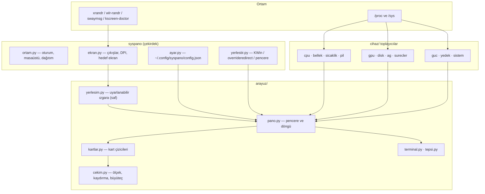

# SysPano — Linux Sistem ve Kaynak İzleme Panosu

CPU, bellek, sıcaklık, fan, pil, GPU, disk, ağ ve süreçleri tek bakışta gösteren
bir Linux panosu. **Her ekran boyutuna ve çözünürlüğe uyum sağlar**: 4K bir
monitörde 4 sütunlu tam pano, bir Raspberry Pi dokunmatik panelinde 2 sütunlu
kompakt pano, küçük bir ikincil ekranda ise yalnızca en önemli kartlar.

Tkinter ile çizilir: **harici Python bağımlılığı yoktur**, her şey `/proc` ve
`/sys`'den okunur. Kurulum tek betikle yapılır; Ubuntu, Debian, Fedora, Arch ve
Raspberry Pi OS üzerinde çalışır.


<sub>Not: görsel değiştiğinde adresteki `?v=` eki artırılmalı — aksi hâlde
tarayıcılar ve GitHub'ın önbelleği eski kareyi göstermeye devam eder.</sub>

<sub>Ekran görüntüsü `syspano --demo` ile alındı: tüm değerler uydurmadır
(makine adı, IP, disk modeli, süreç adları).</sub>

> **Belgeler:** ayrıntılı kurulum, kullanım, ayarlar ve sorun giderme için
> **[wiki'ye](https://github.com/botanguner/syspano/wiki)** bakın.

## Neleri gösteriyor

| Kart | İçerik |
|---|---|
| **CPU** | Toplam kullanım, ortalama GHz, çekirdek sayısı, yük ortalaması, 4 dakikalık grafik |
| **BELLEK** | Kullanılan/toplam GiB, takas (zram) kullanımı, grafik |
| **Pİ SAĞLIĞI** | *(Raspberry Pi)* `vcgencmd get_throttled`: düşük voltaj / kısılma / sıcaklık sınırı — şu an ve önyüklemeden beri; çekirdek voltajı ve ARM saati |
| **SICAKLIK / FAN** | İşlemci paketi °C, en sıcak çekirdek, fan RPM, NVMe/PCH/Wi-Fi sıcaklıkları |
| **PİL** | Yüzde, durum (şarj/boşalma/fişte), güç (W), sağlık, kalan süre |
| **ÇEKİRDEK KULLANIMI** | Her mantıksal çekirdeğin yüzdesi ve anlık frekansı |
| **GEÇMİŞ** | CPU, bellek ve sıcaklık eğrileri (son 4 dakika) |
| **GPU** | Intel (RC6), AMD (`gpu_busy_percent`), NVIDIA (`nvidia-smi`) ve Raspberry Pi VideoCore |
| **DİSK / AĞ** | Kök disk okuma/yazma, doluluk, ağ arayüzü, IP, ↓/↑ hızı |
| **SÜREÇLER** | En çok CPU kullanan süreçler |
| **SERVİSLER** | systemd servislerinin durumu (Apache, MySQL, nginx, Docker…); sayı başlıkta, **kartın başlığına/alt satırına dokununca tüm servisler** kaydırmalı listede, **satıra dokununca günlüğü açılır** |
| **GÜNLÜKLER** | Geliştirici günlükleri: **PHP/PHP-FPM**, Apache, nginx, Laravel/Symfony/WordPress, MySQL/MariaDB, PostgreSQL, Redis, MongoDB, PM2, Caddy, Jenkins, **journald servisleri** (MariaDB, SSH, çekirdek); **dokununca son 200 satır** + "yalnız hata" süzgeci |
| **YEDEK** | *(isteğe bağlı)* gdrive-yedek durumu: son yedek, dosya sayısı, boyut, sıradaki çalışma |
| **SİSTEM** | Ana makine adı, dağıtım, çekirdek, mimari, çalışma süresi, oturum |

Veriler 1 saniyede bir okunur. Gömülü bir **terminal** (⌨ düğmesi) ve isteğe
bağlı bir **tepsi simgesi** vardır.

## Desteklenen cihazlar

SysPano donanımı tahmin etmez, **ne varsa onu bulur** ve olmayan kartı gizler:

| Bileşen | Nasıl bulunur |
|---|---|
| İşlemci sıcaklığı | `coretemp` (Intel), `k10temp`/`zenpower` (AMD), `cpu_thermal` (ARM/RPi), `acpitz`, `/sys/class/thermal` |
| Fan | `asus`, `thinkpad`, `nct67xx`, `it87`, `dell_smm` … ya da ilk sıfırdan büyük `fan*_input` |
| Pil | `type=Battery` olan herhangi bir güç kaynağı (`BAT0`, `CMB0`, …) |
| GPU | Intel `gt_cur_freq_mhz` + RC6, AMD `gpu_busy_percent`, NVIDIA `nvidia-smi`, RPi `vcgencmd` |
| Disk | Kök dosya sisteminin gerçek diski (NVMe/SSD/MMC, btrfs dahil) |
| Ağ | IPv4 varsayılan yolu; Wi-Fi/Ethernet arayüzü, IP adresi, ↓/↑ hızı |
| Güç limiti | Intel/AMD RAPL (PL1/PL2), `platform_profile`, CPU governor |

## Kurulum

Üç yol var; hangisi işinize uyarsa onu kullanın.

### 1. Tek komutla (önerilen)

```bash
git clone https://github.com/botanguner/syspano.git
cd syspano
./install.sh
```

`install.sh` şunları yapar: tkinter'ı denetler, paketi pipx ya da
`pip install --user` ile kurar ve **panoyu nasıl başlatmak istediğinizi sorar**:

| Seçim | Ne kurulur |
|---|---|
| **1) Oturum açılışında (masaüstü)** *(varsayılan)* | `~/.config/autostart/syspano.desktop` — oturum açılınca pano gelir |
| **2) systemd kullanıcı servisi** | `~/.config/systemd/user/syspano.service` — `systemctl --user enable --now syspano`, çökerse systemd yeniden başlatır |
| **3) Yalnızca elle** | Hiçbir otomatik başlatma kurulmaz; panoyu siz başlatırsınız |

Raspberry Pi'de 1 ve 2 numaralı seçenekler **bekçiyle** kurulur (`syspano --bekci`):
pano donar ya da çökerse kendiliğinden geri gelir.

```bash
./install.sh --paket                     # eksik sistem paketini kendisi kurmayı dener (sudo)
./install.sh --baslatma oturum           # sormadan seç (oturum | servis | manuel)
./install.sh --sadece-baslatma --baslatma servis   # paketi kurmadan yalnız başlatma ayarı
./install.sh --sor                       # etkileşimli olmasa bile sor
./install.sh --sistem                    # sistem geneline kur (sudo)
./install.sh --servis                    # (eski) = --baslatma servis
./install.sh --autostart-yok             # (eski) = --baslatma manuel
```

### 2. Elle

```bash
# tkinter (arayüz için zorunlu)
sudo apt install python3-tk        # Debian / Ubuntu / Raspberry Pi OS
sudo dnf install python3-tkinter   # Fedora / RHEL
sudo pacman -S tk                  # Arch

# SysPano
pipx install .                     # ya da:  pip install --user .
```

### 3. Kurulumdan çalıştırma

```bash
./run.sh                 # depodan doğrudan çalıştır
./run.sh --pencere 1200x700
./run.sh test            # tüm testleri çalıştır
```

### Raspberry Pi OS notu

Pi OS (Bookworm) varsayılan olarak Wayland + labwc kullanır. Tkinter **X11**
ister; Xwayland kuruluysa sorun yaşanmaz:

```bash
sudo apt install xwayland
./install.sh --paket
```

Xwayland yoksa ya da pencere yerleştirmede sorun olursa X11 oturumuna geçin
(`sudo raspi-config` → Advanced Options → Wayland → X11).

## Kullanım

```bash
syspano                          # hedef ekranı otomatik seç (ikincil panel varsa o)
syspano --ekran HDMI-A-1         # belirli bir çıkışı kapla
syspano --ekran ana              # birincil ekranı kapla
syspano --ekran tumu             # tüm masaüstünü kapla
syspano --pencere 1200x700       # pencere modunda çalıştır
syspano --olcek 1.4              # ölçeği elle ayarla (DPI otomatiğini ezer)
syspano --tema acik              # açık tema
syspano --kartlar cpu,bellek,gpu # yalnızca bu kartlar
syspano --liste-ekranlar         # bağlı ekranları listele ve çık
syspano --yapilandir             # varsayılan yapılandırma dosyasını oluştur
```

| Seçenek | Açıklama |
|---|---|
| `-e, --ekran AD` | `auto`, `ana`, `tumu`, çıkış adı (`HDMI-A-1`) veya sıra numarası |
| `-m, --mod MOD` | `ekran` (varsayılan), `pencere`, `tam-ekran` |
| `-p, --pencere WxH` | Pencere modu (her masaüstünde çalışır) |
| `--tam-ekran` | Hedef ekranı çerçevesiz kapla |
| `-o, --olcek F` | Sabit ölçek katsayısı (0,7 – 3,0) |
| `--tema koyu\|acik` | Renk teması |
| `--kartlar a,b,c` | Gösterilecek kartları **yalnızca bu çalıştırma için** belirle |
| `--kart-ekle` / `--kart-cikar` | Listeye kart ekle / çıkar ve **kaydet** (kalıcı) |
| `--kartlari-koru` | Kart gizleme; gerekirse kaydır (`--otomatik-kart` tersi) |
| `--yonetilen` | Yöneticisiz pencere yerine normal pencere kullan |
| `--aralik MS` | Güncelleme aralığı (varsayılan 1000 ms) |
| `--terminal-yok` / `--buyutec-yok` / `--tepsi-yok` | İlgili özelliği kapat |
| `--test [SANIYE]` | Test modu: belirtilen süre sonra kapanır |
| `--liste-ekranlar` | Bağlı ekranları listele ve çık |
| `--kartlari-listele` | Kullanılabilir kartları listele ve çık |
| `--servisler` | İzlenen systemd servislerini ve durumlarını listele |
| `--log BIRIM` | Bir servisin günlüğünü yazdır (`--log apache2`, `--log-satir 500`) |
| `--log-kaynaklar` | Bulunan günlük dosyalarını listele (Apache, PHP, Laravel…) — son satırlarındaki hata/uyarı sayısıyla |
| `--log-dosya YOL` | Bir günlük dosyasının sonunu yazdır (`--log-dosya /var/log/php8.2-fpm.log`) |
| `--log-hata` | `--log`/`--log-dosya` çıktısında yalnızca hata ve uyarı satırları |
| `--log-pencere DK` | journald kaynaklarında hata/uyarı sayımı için zaman penceresi (varsayılan 60 dk) |
| `--cek [DOSYA]` | Ekranın/panonun PNG kaydını al ve çık (varsayılan `~/Pictures/syspano-<tarih>.png`) |
| `--bekci` | **Pano bekçisi**: panoyu yoksa başlatır, kalp atışı bayatlarsa (donma) yeniden başlatır |
| `--bekci-aralik SN` / `--bekci-esik SN` | Bekçinin kontrol aralığı (20 sn) / donma eşiği (90 sn) |
| `--bekci-kuru` | Bekçi kararını yalnızca yazsın; hiçbir şeyi başlatıp öldürmesin |
| `--ekran-koruma-yok` | Panel bağlantısı (DSI/dokunmatik) koparsa otomatik yeniden başlatma yapma |
| `--ayarlar` | Pano yerine doğrudan ayar ekranıyla başla |
| `--demo` | Uydurma verilerle çalıştır — ekran görüntüsü almak, arayüzü göstermek veya donanımı olmadan denemek için. Hiçbir sistem dosyası okunmaz, kişisel bilgi görünmez |
| `--guncelle` | Depoyu güncelle (git pull) ve paketi yeniden kur |
| `--guncelle-denetle` | Yeni sürüm var mı denetle (ağa çıkar) |
| `--kurulum-bilgisi` | Kurulum kaydını ve durum dosyalarını göster |
| `--yapilandir` | Varsayılan yapılandırma dosyasını oluştur |
| `--varsayilan-yapilandirma` | Varsayılanları ekrana yaz (dosyaya dokunmaz) |

### Klavye ve fare

| Girdi | İşlev |
|---|---|
| ⌤ üst şeritteki düğmeler | Pano ↔ Terminal ↔ **⚙ Ayarlar** ↔ Kapat |
| Fare tekerleği / sürükleme | Panoyu dikey kaydır (içerik ekrana sığmıyorsa) |
| `Ctrl +` / `Ctrl −` / `Ctrl 0` | Terminal yazı boyutu |
| İmleci durdurmak | Büyüteç: imlecin altındaki bölge 2,6× büyür (yalnızca fare varsa) |
| `Esc` | Ayar ekranından panoya dön |

### Büyüteç ve dokunmatik ekranlar

Büyüteç yalnızca **fareyle** anlamlıdır: imleci bir yere götürüp durdurursunuz,
daire orada belirir. Dokunmatik bir panelde fare olmadığı için bu davranış
ters çalışıyordu — bir dokunuş "imleç durdu" sayılıyor ve daire bir daha
kaybolmuyordu.

Bu yüzden büyüteç artık **kendiliğinden karar veriyor** (`"buyutec": "auto"`):

| Durum | Sonuç |
|---|---|
| Fare ya da dokunmatik yüzey var **ve** ekran yeterince geniş | açık |
| Yalnız dokunmatik ekran (fare yok) | **kapalı** |
| Tasarım alanı 640×320'den küçük (7" 800×480 gibi) | **kapalı** |
| `"buyutec": true` / `--buyutec` | elle açık |
| `"buyutec": false` / `--buyutec-yok` | elle kapalı |

Ayrıca daire, **imleç gerçekten oynadıktan sonra** belirir; pencere imlecin
altında açıldığında gelen tek "hayalet" hareket olayı büyüteci açmaz. Panoya
dokunmak/tıklamak da daireyi kapatır ve yeniden gerçek hareket beklenir.
Uygulama açılışta hangi kararı verdiğini yazar: `büyüteç : kapalı (fare yok
(dokunmatik ekran))`.

## Güncelleme

GitHub'dan klonlayıp kuranlar için iki yol var; ikisi de aynı işi yapar.

### Komut satırından

```bash
cd ~/syspano
./guncelle.sh --denetle     # önce bak: yeni commit/sürüm farkı var mı?
./guncelle.sh               # güncelle: depoyu ilerlet + paketi yeniden kur
```

`guncelle.sh` şunları yapar: uzak depoyu çeker, geride kalan commit'leri listeler,
yerel değişiklik varsa **durdurur** (`--zorla` ile `git stash` yapıp devam eder),
`git merge --ff-only` ile ilerletir, `install.sh`'ın yazdığı **kurulum kaydına**
bakarak paketi aynı yöntemle (pipx / pip --user) yeniden kurar ve sonucu doğrular.

> [!IMPORTANT]
> **`git pull` yapmak kurulumu güncellemez.** Depoyu ilerletmek yeterli değildir;
> paketin de yeniden kurulması gerekir. Betik bunu bilir: yeni commit olmasa bile
> **kurulu paket sürümü depodan farklıysa** yeniden kurar. `syspano --surum` hâlâ
> eski sürümü gösteriyorsa `./guncelle.sh --zorla-kur` çalıştırın.

Kurulu sürümü her zaman elle de doğrulayabilirsiniz:

```bash
python3 -c "import syspano,sys;print(syspano.__version__, sys.executable)"
```

Paketin kendi komutları da aynı işi yapar ve SSH'de de çalışır:

```bash
syspano --guncelle-denetle   # yerel sürüm + uzak durum
syspano --guncelle           # güncelle ve yeniden kur
syspano --kurulum-bilgisi    # nasıl kuruldu, kayıt nerede
```

### Pano üzerinden (dokunmatik)

⚙ düğmesi → **SÜRÜM** bölümü:

| Düğme | İşlev |
|---|---|
| **Güncellemeyi denetle** | Yeni sürüm var mı bakar (ağa çıkar) |
| **Güncelle (arka planda)** | Güncellemeyi ayrı bir süreçte başlatır; pano donmaz |
| **Panoyu yeniden başlat** | Yeni kodu yükler |

**Durum her zaman görünür.** SÜRÜM bölümündeki renkli satır ne olduğunu söyler:

| Satır | Anlamı |
|---|---|
| `⟳ Denetleniyor… (ağa çıkılıyor)` | Denetim sürüyor (en fazla 30 saniye) |
| `✓ Güncel · son denetim 5 dk önce` | Yeni sürüm yok (yeşil) |
| `⬆ Yeni sürüm var: 1.4.1 — «Güncelle»ye dokunun` | Güncellenebilir (sarı) |
| `⚠ Denetlenemedi: …` / `⚠ Denetim zaman aşımına uğradı` | Ağ ya da git sorunu (kırmızı) |
| `⏳ Güncelleme sürüyor… (42 sn)` | Güncelleme arka planda çalışıyor |
| `✓ Güncelleme tamam (1.4.1) — Panoyu yeniden başlatın` | Bitti; yeniden başlatma bekliyor |
| `⚠ Güncelleme başarısız — …` | Hata (ayrıntı `guncelleme.log`) |
| `⟳ Kurulu paket 1.4.1, bellekteki kod 1.4.0 — Panoyu yeniden başlatın` | Güncelleme kuruldu ama pano eski kodu bellekte tutuyor |

Sonuç ayrıca ekranın altında **bildirim** olarak da çıkar; ⚙ düğmesinin sağ üstündeki
**sarı nokta** yalnızca "yeni sürüm var" değil, "yeniden başlatma bekliyor"
durumunda da yanar. Denetim günde bir kez arka planda kendiliğinden yapılır
(`guncelleme_denetimi`).

> [!IMPORTANT]
> Güncelleme sonrası pano **yeniden başlatılmalıdır**: Python kodu bellekte
> kalır. Pano hangi yolla başlatıldıysa ona uygun komut söylenir — servis olarak
> çalışıyorsa `systemctl --user restart syspano`, masaüstü oturumunda
> kendiliğinden başlatıldıysa ⚙ → **Panoyu yeniden başlat**. Doğru olanı
> `syspano --guncelle-denetle` ve `guncelleme.log` da yazar.

Günlükler ve durum dosyaları:

| Yol | İçerik |
|---|---|
| `~/.local/state/syspano/kurulum.json` | Kurulum kaydı: yöntem, kaynak dizin, sürüm |
| `~/.local/state/syspano/surum-denetimi.json` | Son denetimin sonucu |
| `~/.local/state/syspano/guncelleme.log` | Panodan başlatılan güncellemenin çıktısı |

Kurulum kaydı yoksa (depo kopyalanmadan kurulduysa) elle güncelleyin:

```bash
python3 -m pip install --user --upgrade /yol/syspano
# ya da depo adresinden:
python3 -m pip install --user --upgrade git+https://github.com/botanguner/syspano.git
```

## Ayarlar (pano üzerinden)

Üst şeritteki **⚙** düğmesi (ya da `syspano --ayarlar`) panoyu ayar ekranına
çevirir. Ayrı pencere açılmaz, her şey aynı tuvalde çizilir; değişiklikler
**anında uygulanır** ve `~/.config/syspano/config.json`'a yazılır.

| Ayar | Seçenekler | Not |
|---|---|---|
| **Ölçek** | 0,70 – 3,00 kaydırıcı + −/+ + **Oto** | Canlı; *Oto* DPI hesabına döner |
| **Tema** | Koyu / Açık | Canlı |
| **Büyüteç** | Otomatik / Açık / Kapalı | Canlı |
| **Güncelleme** | 0,5 / 1 / 2 / 5 sn | Ölçüm aralığı |
| **Hedef ekran** | Otomatik / Ana / çıkışlar / Tümü | **Yeniden başlatma gerekir** |
| **Gömülü terminal** | açık/kapalı | sonraki açılışta |
| **Tepsi simgesi** | açık/kapalı | **Yeniden başlatma gerekir** |
| **Kartları otomatik gizle** | açık/kapalı | Canlı |
| **Kartlar** | 13 kart için anahtar | Canlı |
| **Başlatma** | Yöntem ve durumu görünür; servis kurulu değilse **kur**, çalışıyorsa **durdur / yeniden başlat** | Anında |
| **Sürüm** | denetle / güncelle / yeniden başlat / sıfırla | — |

### Neden dokunmatik için uygun

- Her denetim en az **46 tasarım birimi** yüksekliğinde; 800×480'lik bir panelde
  bu ~64 piksel eder, parmakla rahat basılır.
- Kaydırıcı çubuğunun görünen yüksekliği 8 birim ama **dokunma alanı 46 birim**
  — çubuğun herhangi bir yerine dokunup sürüklemek yeter, ince tutamacı
  tutturmaya çalışmak gerekmez. Ayrıca −/+ düğmeleri ve **Oto** vardır.
- Yalnızca **dokunma** ve **sürükleme** kullanılır: üzerine gelme (hover), sağ
  tık ve tekerlek zorunluluğu yok. Parmakla yukarı/aşağı sürüklemek listeyi
  kaydırır (sağ kenarda kaydırma çubuğu görünür).
- Dar panelde etiket üstte, denetim altta tam genişlikte; geniş ekranda etiket
  solda, denetim sağda. Aynı kod her ikisini de üretir.

Ayar ekranının yerleşimi saf bir fonksiyondur (`arayuz/ayar_ekrani.py:yerlesim`),
bu yüzden her ekran boyutunda otomatik test edilir: denetimler çakışmaz, dokunma
hedefleri küçülmez, hiçbir öğe ölçekli sınırların dışına çıkmaz.

## Yapılandırma

Yapılandırma dosyası: `~/.config/syspano/config.json` (ilk çalıştırmada
otomatik oluşmaz; `syspano --yapilandir` ile oluşturabilirsiniz). Komut satırı
seçenekleri her zaman dosyayı geçersiz kılar.

```json
{
  "ekran": "auto",
  "mod": "ekran",
  "pencere": [1280, 720],
  "olcek": null,
  "tema": "koyu",
  "kartlar": ["cpu", "bellek", "sicaklik", "pisaglik", "pil", "cekirdek",
              "gecmis", "gpu", "disk_ag", "servisler", "loglar", "surecler",
              "yedek", "sistem"],
  "buyutec": "auto",
  "terminal": true,
  "terminal_yazi": null,
  "tepsi": true,
  "guncelleme_ms": 1000,
  "guncelleme_denetimi": true,
  "otomatik_kart": true,
  "yedek_durum_yolu": "~/.local/state/gdrive-yedek/durum.json",
  "yedek_zamanlayici": "yedek.timer",
  "servisler": [],
  "servis_log_dosyalari": {},
  "log_dosyalari": [],
  "log_pencere_dk": 60,
  "servis_aralik": 30,
  "servis_log_satir": 200,
  "uygulama_basligi": "SysPano"
}
```

## Uyarlanabilirlik nasıl çalışır

### 1. Ölçek (S) — DPI'dan

Ekranın milimetre bilgisi (`xrandr`) üzerinden inç başına piksel hesaplanır ve
`S = DPI / 96` alınır. Yani yazı ve çizgiler **fiziksel olarak** her ekranda
benzer büyüklükte görünür: 92 dpi bir monitörde 1×, 213 dpi bir dizüstü
panelinde ~2,2×, 411 dpi bir mikro panelde 3×.

Tasarım uzayı pencereden türetilir: `tasarım_g = genişlik / S`. Tüm koordinatlar
bu uzaydadır ve çizim sırasında `S` ile çarpılır.

### 2. Sütun sayısı — genişlikten

`bağlantı = genişlik / S` değerine göre 1–4 sütun seçilir:

| Ekran | Çözünürlük | Ölçek | Tasarım | Sütun |
|---|---|---|---|---|
| 24" monitör | 1920×1080 @ 92 dpi | 0,96 | 2003×1126 | 4 |
| Dizüstü paneli | 2592×1458 @ 213 dpi | 2,2 | 1168×657 | 4 |
| İkincil mikro panel | 2160×1080 @ 411 dpi | 3,0 | 720×360 | 2 |
| Raspberry Pi 7" | 800×480 @ 134 dpi | 1,4 | 573×343 | 2 |
| 3,5" küçük panel | 480×320 @ 165 dpi | 1,0 | 480×320 | 1 |

### 3. Kart yükseklikleri — mevcut alandan

Kartların yüksekliği sabit değildir; satırlar mevcut yüksekliği ağırlıklarına
göre paylaşır. Yer yetmezse:

1. Satırlar **eşit** yüksekliğe geçer (küçük ekranda daha çok satır sığar),
2. hâlâ sığmıyorsa **düşük öncelikli kartlar** gizlenir (önce `sistem`, sonra
   `yedek`, `süreçler`, `geçmiş` …; `CPU` ve `BELLEK` her zaman kalır),
3. yine sığmazsa pano **kaydırılabilir** olur (tekerlek/sürükleme).

Veri olmayan kartlar (pil yok, GPU okunamadı, yedek kurulu değil, sıcaklık
sensörü yok) baştan gizlenir; yer diğer kartlara kalır.

### 4. Kart içleri — kendi dikdörtgenlerine

Her kart çizilirken aldığı dikdörtgene uyar: çok alçak bir kartta yalnızca büyük
değer ve çubuk, yüksek bir kartta ek satırlar ve grafik görünür; dar kartta uzun
metinler `…` ile kısaltılır. `tests/test_kartlar.py` bunu otomatik denetler:
her kart, 10 farklı boyutta çizilir ve hiçbir öğe kartın dışına taşamaz.

## Hedef ekran seçimi

```bash
syspano --liste-ekranlar
```
```
  [0] eDP-1        2592x1458+0+0  309x174mm  213 dpi  (birincil)
  [1] HDMI-A-1     2160x1080+220+1458  66x134mm  411 dpi  (ikincil)
```

`auto` önce **birincil olmayan** ekranı arar; tek bir ikincil varsa onu seçer,
birden fazlaysa en küçüğünü. Yani "yan panelde pano" kullanımı için ayar
gerekmez: `syspano`.

## Pencere yerleştirme

Masaüstüne göre farklı yol izlenir; hepsi aynı görünümü verir:

| Ortam | Yöntem |
|---|---|
| KDE (KWin) | KWin betiği: çerçevesiz, görev çubuğunda yok, en üstte; klavye odağı için yönetilen pencere |
| Diğer X11 / Xwayland (GNOME, Xfce, sway, labwc, RPi) | `overrideredirect` pencere: yöneticisiz, tam konum, en üstte |
| `--pencere` | Normal pencere: her yerde çalışır |

> [!NOTE]
> Wayland'de istemciler pencere konumunu seçemez. Tkinter zaten X11/Xwayland
> kullanır, bu yüzden konumlandırma Xwayland'ın sanal ekran koordinatlarında
> yapılır; bu KDE, GNOME ve wlroots oturumlarında çalışır. Saf Wayland'de
> (Xwayland yoksa) Tkinter açılamaz — Xwayland kurun ya da X11 oturumu kullanın.

## Terminal ve tepsi

- **Terminal**: Üst şeritteki ⌨ düğmesi panonun yerini tam ekran bir terminale
  bırakır (PTY + VT100 ayrıştırıcı + Tk Canvas). `Ctrl +/−/0` ve
  `Ctrl + tekerlek` yazı boyutunu ayarlar; boyut `config.json`'a yazılır.
  `vim`, `htop` gibi programlarda gelişmiş kaçış dizileri kusurlu görünebilir.
- **Tepsi** (isteğe bağlı, PySide6): `pip install PySide6`. Görev çubuğunun sağ
  tarafındaki simgeden panoyu gizleyip gösterebilir, görünümü değiştirebilir,
  kaydırabilir ve `Ctrl +/−` ile aynı yazı boyutu menüsünü kullanabilirsiniz.
  Pano ile tepsi **dosya üzerinden** konuşur (`$XDG_RUNTIME_DIR/syspano/`).

## Mimari



| Dosya | Görevi |
|---|---|
| `src/syspano/cli.py` | Komut satırı, ortam denetimi, başlatma |
| `src/syspano/ekran.py` | Çıkışları bulur, DPI hesaplar, hedef ekranı seçer |
| `src/syspano/yerlestir.py` | Pencereyi masaüstüne göre yerleştirir |
| `src/syspano/toplayici.py` | Tüm toplayıcıları tek sözlükte birleştirir |
| `src/syspano/cihaz/*.py` | Her bileşen için bağımsız, hataya dayanıklı okuyucu |
| `src/syspano/arayuz/yerlesim.py` | **Saf** uyarlanabilir yerleşim (Tk'sız, test edilebilir) |
| `src/syspano/arayuz/ayar_ekrani.py` | **Saf** ayar ekranı yerleşimi + dokunmatik denetimler |
| `src/syspano/guncelleme.py` | Kurulum kaydı, sürüm denetimi, `git pull` + yeniden kurulum |
| `arac/olcum.py` | Kaynak profili: modül modül süreler, çizim karesi, kaydırma maliyeti |
| `install.sh` / `guncelle.sh` / `uninstall.sh` | Kur, güncelle, kaldır (apt/dnf/pacman/zypper tanır) |
| `src/syspano/arayuz/kartlar.py` | Kart çizicileri (dikdörtgene uyarlanır) |
| `src/syspano/arayuz/cekim.py` | Tasarım→piksel dönüşümü, kaydırma, büyüteç kırpması |
| `src/syspano/arayuz/pano.py` | Pencere, olaylar, çizim döngüsü, tepsi iletişimi |
| `src/syspano/arayuz/terminal.py` | Gömülü terminal (PTY + VT100) |
| `src/syspano/tepsi.py` | Sistem tepsisi simgesi (PySide6, isteğe bağlı) |

## Geliştirme ve testler

```bash
./run.sh test                                # tüm testler
PYTHONPATH=src python3 tests/test_yerlesim.py    # yerleşim (Tk gerekmez)
PYTHONPATH=src python3 tests/test_kartlar.py     # kart taşması denetimi
PYTHONPATH=src python3 tests/test_cihaz.py       # gerçek donanım okuma
PYTHONPATH=src python3 tests/test_servisler.py   # servis durumu ve günlük
PYTHONPATH=src python3 tests/test_uygulama.py    # pano + büyüteç + terminal
PYTHONPATH=src python3 tests/test_belgeler.py    # README/wiki kodla uyumlu mu
PYTHONPATH=src python3 tests/test_loglar.py      # günlük keşfi ve kuyruk okuma
```

| Test | Neyi denetler |
|---|---|
| `test_yerlesim.py` | 14 farklı ekran boyutunda/oranında dikdörtgenler çakışmıyor, taşmıyor, sütun sınırı aşılmıyor |
| `test_kartlar.py` | Her kart 10 boyutta çizilir, hiçbir öğe kartın dışına çıkmaz |
| `test_geometri.py` | Büyüteç kırpma matematikleri (çokgen ve parça kırpma) |
| `test_ekran.py` | `xrandr` ayrıştırma, DPI hesabı, hedef ekran seçimi |
| `test_cihaz.py` | Toplayıcılar gerçek donanımda çökmeden veri üretiyor mu; **seyreltme ve önbellekler** (süreç taraması 3 sn, yavaş sensör, sensör haritası, GPU kart listesi, `which`) |
| `test_servisler.py` | `systemctl show`/`list-units` ayrıştırma, **takma ad çözümü** (mysqld → mariadb), `∞` bellek değeri, log dosyası kuyruğu, önbellek |
| `test_demo.py` | Demo verisi bu makineden iz taşımıyor ve kartların beklediği şekle uyuyor |
| `test_ortam.py` | Fare/dokunmatik ayrımı (girdi aygıtları) ve büyüteç kararı |
| `test_ayar.py` | Yapılandırma; varsayılanların dosyaya düşmemesi |
| `test_ayar_ekrani.py` | Ayar ekranı yerleşimi: çakışma yok, dokunma hedefleri yeterli, çizim ölçeğe uyuyor, isabet denetimi |
| `test_guncelleme.py` | Sürüm karşılaştırma, kurulum kaydı ve **gerçek git senaryosuyla** güncelleme |
| `test_uygulama.py` | Pano kurulur, çizilir; büyüteç koşulları, terminal geçişi, ayar ekranında dokunma, **servis kartı ve günlük görünümü**; kare öğeleri birikmiyor, çizim döngüsü çoğalmıyor, gizliyken çizilmiyor |
| `test_belgeler.py` | **Belge–kod uyumu**: README'deki `config.json` örneği gerçek varsayılanlarla aynı mı, her ayar anahtarı kodda okunuyor mu (ölü anahtar yok), README'deki test sayısı doğru mu, yeni kart/seçenek README'ye yazılmış mı |
| `test_loglar.py` | Günlük keşfi (glob, `~`, dedupe, izin), **kuyruk okuma** (son N satır, CRLF, `\n`'siz son satır, bayt sınırı), hata/uyarı özeti, süzgeç ve keşif/stat önbelleği |

Toplam **22 dosyada 201 test**. Ayrıca kaynak profili için: `python3 arac/olcum.py`.

Ölçek ve yerleşimi denemek için:

```bash
./run.sh --pencere 1400x900 --olcek 0.94     # 4 sütunlu tam pano
./run.sh --pencere 620x380 --olcek 0.7       # küçük ekran taklidi
./run.sh --demo --pencere 1500x900           # uydurma verilerle (ekran görüntüsü için)
```

## Performans

Pano her saniye ölçüp çizer; amaç bu işi olabildiğince ucuza yapmak. Ölçüm
aracıyla alınan sonuçlar (14" dizüstü, 1400×880 pencere):

| Ölçüm | Önce | Sonra |
|---|---|---|
| **Toplam (pano modu)** | ~%5,0 çekirdek · 50 ms/sn | **%2,35 · 23,5 ms/sn** |
| Toplayıcı (11 modül) | 39,5 ms/sn | **21,7 ms/sn** |
| Çizim karesi | 20,6 ms | **3,6 ms** |
| Pencere gizliyken (tepsiden) | ~%5 | **%1,6** |

En büyük üç kazanç:

**1. Kare değiştirme (5,8×).** Tk'de `delete("all")` sonrası öğe oluşturmak, her
öğe için "hasarlı bölge" hesabı yüzünden çok pahalıdır. Pano artık yeni kareyi
**eskisi henüz tuvalde dururken** çiziyor, sonra eskisini siliyor
(`KARE` / `KARE_YENI` etiketleri). Aynı ölçümde 23,6 ms → 2,8 ms.

**2. Uyarlanabilir sensör seyreltmesi.** Sensör başına okuma maliyeti
farkeder: `coretemp` 0,04 ms, ama NVMe sıcaklığı **9,25 ms** (her okumada diske
SMART komutu) ve kablosuz kartı 1,0 ms. Harita kurulurken her sensörün maliyeti
ölçülür ve yavaş olanlar seyreltilir:

| Okuma maliyeti | Aralık |
|---|---|
| < 0,3 ms | her ölçüm (1 sn) |
| 0,3 – 2 ms | 5 saniyede bir |
| ≥ 2 ms | 10 saniyede bir |

Bu tek değişiklik "sıcaklık" modülünü **9,9 ms → 0,6 ms**'ye indirdi.

**3. Nadiren değişen şeyleri önbelleğe almak.** GPU kart listesi ve sysfs
yolları 60 sn'de bir taranır; `which()` sonucu saklanır; süreç listesi
(`/proc` taraması, 8 ms) 3 sn'de bir; `nvidia-smi` (~30 ms, süreç başlatır)
kart boştayken 2 sn'de bir; `vcgencmd` 3 sn'de bir. Seyreltilen değerler arada
son okunan değeri gösterir.

Ayrıca pencere gizliyken (tepsiden saklandığında) hiç çizim yapılmaz, büyüteç
kapalıyken bekçi zamanlayıcısı 4 kat seyrek çalışır.

Kullanıcı tarafındaki en etkili ayar **güncelleme aralığı**dır
(⚙ → Güncelleme): 1 sn yerine 2 sn seçmek CPU'yu yarıya indirir.

### Ölçüm

```bash
python3 arac/olcum.py             # üretim temposunda modül modül (22 sn)
python3 arac/olcum.py --cizim     # çizim karesi ve kaydırma maliyeti de
python3 arac/olcum.py --hizli     # modülleri art arda (seyreltme görünmez)
```

> [!NOTE]
> Mutlak süreler cihaza göre değişir: Raspberry Pi 4, bu dizüstünden yaklaşık
> 3–4 kat yavaştır, ama oranlar aynıdır ve seyreltme mantığı orada da geçerlidir.

## Raspberry Pi / kiosk kurulumu

Pi'de panoyu **gözetimsiz** çalıştırmak için tek komut:

```bash
./kur-pi.sh                 # bekçi + oturum açılışı + kalıcı günlük
./kur-pi.sh --kuru          # yalnızca ne yapacağını yaz
./kur-pi.sh --kartlar-ekle pisaglik,loglar
./kur-pi.sh --geri-al       # yaptıklarını geri al
```

Ne yapar:

| Adım | Ayrıntı |
|---|---|
| **Bekçi** | `syspano --bekci` oturum açılışına eklenir; pano çöker ya da **donarsa** kendiliğinden geri gelir (bkz. [Bekçi](#bekçi-gözetimsiz-panolar)) |
| **Çift başlatma yok** | labwc kullanılıyorsa eski XDG oturum girdisi kapatılır (`~/.config/labwc/autostart` tek sahip olur) |
| **Kalıcı günlük** | `journald` 200 MB sınırla kalıcı yapılır: Raspberry Pi OS varsayılanı `Storage=volatile` olduğu için **fiş çekildiğinde günlükler silinir** ve donma nedeni bulunamaz (`--gunluk-yok` ile atlanır) |
| **Kartlar** | `--kartlar-ekle` ile Pİ SAĞLIĞI, GÜNLÜKLER gibi yeni kartlar yapılandırmaya eklenir |

> [!TIP]
> Kurulumdan sonra donma benzetimi: `sudo kill -STOP $(pgrep -f 'local/bin/syspano$')`
> — bekçi kalp atışının bayatladığını görüp panoyu kapatır, tanıyı
> `~/.local/state/syspano/pano.log`'a yazar ve yeniden başlatır.

## Ekran görüntüsü

Panonun (ya da ekranın) PNG kaydını almak için:

```bash
syspano --cek                      # ~/Pictures/syspano-<tarih>.png
syspano --cek /tmp/pano.png        # belirli dosya
```

Wayland oturumunda **grim**, X11'de **scrot** kullanılır (kurulu olmalı). Pano
çalışırken de tetiklenebilir: tepsi iletişim dosyasına `cek` yazmak ekran
görüntüsü alır ve nereye kaydedildiğini bildirim olarak gösterir — örneğin bir
donanım düğmesine ya da SSH'den uzaktan bağlamak için:

```bash
echo cek > "${XDG_RUNTIME_DIR:-/tmp}/syspano/komut"     # pano görüntüyü alır
```

> [!NOTE]
> Raspberry Pi'de (labwc/Wayland) `grim` genelde kuruludur; değilse
> `sudo apt install grim`. ImageMagick `import` bilerek kullanılmaz: X11'de
> pencere seçimi için etkileşimli bekleyip otomasyonu kilitleyebiliyor.

## Bekçi (gözetimsiz panolar)

Duvar panosu / kiosk gibi **elle müdahale edilmeyen** kurulumlarda pano donabilir
(ekran kımıldamaz, süreç yaşıyordur) ya da çökebilir. Bekçi bunu kendiliğinden
toparlar:

```bash
syspano --bekci                    # aralık 20 sn, donma eşiği 90 sn
syspano --bekci --bekci-esik 45    # daha sabırsız
syspano --bekci-kuru               # yalnız kararını yazsın (deneme)
```

0. **Aynı anda tek bekçi çalışır:** ikinci kopya kendini kapatır.
1. **Pano yoksa başlatır.** Açılışta Xwayland/Tk hazır değilse pano ölebilir;
   bekçi her turda yeniden dener, yani yarış koşullarına dayanır.
2. **Kalp atışı bayatlarsa öldürür.** Yeni başlayan panoya 15 saniye tolerans tanınır (ilk kalp atışını yazana kadar öldürülmez). Pano 3 saniyede bir
   `$XDG_RUNTIME_DIR/syspano/durum.json` yazar; bu dosyanın yaşı eşiği geçtiyse
   pano donmuş sayılır, `SIGTERM` (gerekirse `SIGKILL`) ile kapatılır ve bir
   sonraki turda yeniden başlatılır.
3. **Öldürmeden önce tanı kaydı yazar** — süreç durumu (`State:`), beklediği
   çekirdek fonksiyonu (`wchan`) ve kalp yaşı — böylece donma sonradan
   incelenebilir. Günlük: `~/.local/state/syspano/pano.log`.
4. **Panel bağlantısı koparsa kontrollü yeniden başlatır.** Raspberry Pi'nin
   resmî 7" panelinde DSI bağlantısı ve dokunmatik kopabiliyor:

   ```
   vc4-drm gpu: [drm] *ERROR* DSI1: LP0 contention error
   edt_ft5x06 10-0038: Unable to fetch data, error: -5
   ```

   Bu durumda **ekran ölür ama sistem çalışmaya devam eder**; kullanıcı fişi
   çeker (SD kart için tehlikelidir — kirli kapanma). Bekçi çekirdek günlüğünde
   bu imzaları görürse (son 5 dakikada ≥ 3 imza) **kontrollü yeniden başlatma**
   yapar: kabloyu/bağlantıyı yeniden kurar ve fiş çekmekten güvenlidir.
   Koruma: açılıştan sonraki ilk 5 dakika ve iki müdahale arasında en az 10
   dakika bekler (döngüye girmesin); `--ekran-koruma-yok` ile kapatılır.

Raspberry Pi'de oturum açılışına eklemek için `~/.config/labwc/autostart`:

```bash
/home/botan/.local/bin/syspano --bekci &
```

> [!TIP]
> Bekçi, XDG autostart (`.desktop`) yarışına takılan panolar için de çözümdür:
> pano ne zaman ölürse ölsün en fazla `--bekci-aralik` saniye sonra geri gelir.

## Bekçi ve ekran görüntüsü durum dosyaları

| Yol | İçerik |
|---|---|
| `${XDG_RUNTIME_DIR}/syspano/durum.json` | Kalp atışı ve tepsi iletişimi (pano 3 sn'de bir yazar) |
| `~/.local/state/syspano/pano.log` | Pano çıktısı + bekçinin karar/tanı satırları |

## Servisler ve günlükler

Sunucu makinelerde Apache, MySQL/MariaDB, PostgreSQL, nginx, Docker gibi
servislerin çalışıp çalışmadığını gösterir ve **günlüklerine panodan erişim**
sağlar. systemd yoksa kart kendiliğinden gizlenir.

| Nerede | Ne |
|---|---|
| **SERVİSLER kartı** | Her satırda renkli durum noktası (yeşil çalışıyor · gri kapalı · kırmızı bozuk), ad, çalışma süresi ve bellek. Bozuklar en üstte |
| **Günlük görüntüleyici** | Bir satıra **dokununca** açılır: son 200 satır (`journalctl` ya da tanımlı log dosyası), parmakla kaydırma, `⟳ Yenile` düğmesi, açıkken 8 saniyede bir kendiliğinden tazeleme |
| **Komut satırı** | `syspano --servisler` ve `syspano --log apache2 --log-satir 500` (SSH'de de çalışır) |

**Hangi servisler izlenir?** Yaygın sunucu servisleri (apache2, httpd, nginx,
mysql, mysqld, mariadb, postgresql, docker, podman, redis, php-fpm, named,
postfix, smbd, cups, sshd…) **kurulu olanlar**, ayrıca **başarısız (failed)**
birimler ve `config.json`'da `"servisler"` ile ekledikleriniz. systemd takma
adları asıl ada çevrilir (ör. `mysqld.service` → `mariadb.service`).

Kendi log dosyalarını gösteren servisler için (Apache'nin
`/var/log/apache2/error.log`'u gibi) yapılandırmada yol verin:

```json
{
  "servisler": ["apache2", "mysql"],
  "servis_log_dosyalari": {
    "apache2": "/var/log/apache2/error.log",
    "mysql": "/var/log/mysql/error.log"
  }
}
```

> [!NOTE]
> **Maliyet ölçülerek ayarlandı:** tüm birimleri listelemek ~100 ms sürdüğü için
> keşif yalnızca açılışta ve 10 dakikada bir yapılır; durum ise tek
> `systemctl show` çağrısıyla **30 saniyede bir** okunur (~90 ms; 10 saniyede
> bir sormak 8,7 ms/sn, 30 saniyede bir 2,9 ms/sn ediyor). Günlük yalnızca
> görüntüleyici açıkken okunur. `servis_aralik` ile sıklığı değiştirebilirsiniz.

> [!TIP]
> `/var/log` altındaki bazı dosyalar yalnızca root ya da `adm`/`systemd-journal`
> grubuna okunabilir. Pano root olarak çalışmadığı için o dosyaları okuyamazsa
> `journalctl` çıktısına düşer; tam erişim isterseniz kullanıcıyı gruba ekleyin.

### Günlük dosyaları (geliştirici günlükleri)

**GÜNLÜKLER** kartı, sunucuda ve geliştirme makinesinde aranan günlük
dosyalarını kendiliğinden bulur; bir satıra dokunmak son 200 satırı açar.
Panonun geri kalanı gibi bu kart da **var olmayanı gizler**: hiç günlük
bulunamazsa kart çizilmez, bulunmayan yollar sessizce elenir.

| Grup | Aranan dosyalar |
|---|---|
| **PHP** | `/var/log/php*-fpm.log`, `php-fpm.log`, `php*-fpm-slow.log`, `/var/log/php/error.log`, `/var/log/php_errors.log` |
| **Uygulama** | Laravel (`*/storage/logs/*.log`), Symfony (`*/var/log/*.log`), WordPress (`wp-content/debug.log`), PM2 (`~/.pm2/logs/*`), Gunicorn, Caddy |
| **Apache / nginx** | `/var/log/apache2/error.log` · `access.log` (Debian/Pi), `/var/log/httpd/error_log` (Fedora/RHEL), `/var/log/nginx/error.log` · `access.log` |
| **Veritabanı** | MySQL/MariaDB `error.log` ve yavaş sorgu günlüğü, PostgreSQL, Redis, MongoDB |
| **Sunucu** | Jenkins, `syslog`, `messages`, `kern.log`, `auth.log`, paket yöneticisi günlükleri |
| **journald** | Dosya günlüğü **olmayan** servisler `journalctl` üzerinden: **MariaDB, MySQL, PostgreSQL, Redis, Docker, SSH** ve **çekirdek** günlüğü (`journalctl -k`). Kartta sağda `journal` yazar |

**journald kaynakları neden gerekli?** Debian/Ubuntu/Pi'de MariaDB ve PostgreSQL
günlüklerini dosyaya değil **journald**'a yazar (`/var/log/mysql/error.log`
yoktur), `rsyslog` kurulu değilse `/var/log/syslog` de yoktur. Bu yüzden
kurulu **ve çalışan** (ya da `failed`) servisler tek bir `systemctl show`
çağrısıyla bulunup `journalctl` kaynağı olarak listeye eklenir.

Kendi dosyalarınızı `log_dosyalari` ile ekleyin (glob ve `~` desteklenir);
`journal:` ön ekiyle bir systemd birimini de ekleyebilirsiniz:

```json
{
  "log_dosyalari": [
    "~/projelerim/*/storage/logs/*.log",
    "/srv/api/logs/error.log",
    "journal:benim-servisim"
  ]
}
```

Kart satırları **gruba göre** (geliştiriciye en yakın grup önce), grup içinde
**en son yazılan önce** sıralanır; her satırda son yazılma yaşı ve dosya boyutu
görünür (90 saniyeden yeni olanlar yeşil). Görüntüleyici başlığı okunan
satırların **hata ve uyarı sayısını** yazar; **Yalnız hata** düğmesi yalnızca
hata/uyarı satırlarını bırakır — yüz binlerce satırlık bir Laravel günlüğünde
kaybolmazsınız. Komut satırından da aynı günlükler:

```bash
syspano --log-kaynaklar                    # bulunan dosyalar + hata/uyarı sayısı
syspano --log-dosya /var/log/php8.2-fpm.log --log-satir 500
syspano --log-dosya ~/proje/storage/logs/laravel.log --log-hata   # yalnız hatalar
syspano --log mariadb --log-pencere 15     # son 15 dakikanın hata/uyarı sayısı
```

**Sayım ölçütü zaman penceresidir (journald):** "son 200 satır" yanıltıcı
olabiliyordu — sakin bir günlükte aylar önceki açılış hataları hâlâ o pencerede
kalıp "8 hata" gösteriyordu (Raspberry Pi'de MariaDB'de görüldü). Bu yüzden
hata/uyarı sayısı **son 60 dakikaya** göre hesaplanır (dosya günlüklerinde satır başındaki zaman damgası okunur: ISO, `2026/10/10 12:48:12` ve Apache `[Thu Oct 08 … 2026]`; damga yoksa son satırlara düşülür)
(`log_pencere_dk` ya da `--log-pencere`). Dosya kaynaklarında zaman damgası
garantisi olmadığı için son satırlar kullanılır.

> [!NOTE]
> **Maliyet yine ölçüldü:** dosya keşfi (`glob` + `stat`) dizüstünde **~1 ms**,
> Raspberry Pi'de **~2,7 ms**; journald birimleri için **tek** `systemctl show`
> çağrısı eklenir (~40–90 ms). İkisi birlikte kaynak listesini 10 dakikada bir
> tazeler, yani saniyeye düşen maliyet **~0,2 ms**'dir. Boyut/yaş tazeleme
> 5 saniyede bir (dosya başına ~0,005 ms; journal kaynakları için stat yok).
> Dosya **içeriği** yalnızca görüntüleyici açıkken okunur: 200 satır ≈ 0,14 ms,
> en fazla 512 KiB (tek satırlık dev bir günlük belleği şişirmesin). Kart
> hiçbir dosyanın içeriğini okumaz — SD kartta her okuma pahalıdır.

## Teknolojiler

| Katman | Kullanılan |
|---|---|
| Dil | **Python 3.9+** (test edilen: 3.9–3.14) |
| Arayüz | **tkinter** (Canvas) — harici bağımlılık yok, dağıtımın `python3-tk` paketiyle gelir |
| Veri kaynakları | `/proc`, `/sys` (sysfs), `xrandr` / `kscreen-doctor` / `wlr-randr` / `swaymsg`, `systemctl` / `journalctl`, `nvidia-smi`, `vcgencmd` |
| Pencere yönetimi | X11/XWayland, KWin betikleri (qdbus), `overrideredirect` |
| Opsiyonel | **PySide6** (tepsi simgesi), ImageMagick (ekran görüntülerinin meta verisini sıyırmak için) |
| Paketleme | `pyproject.toml` (pip/pipx), `install.sh` / `guncelle.sh`, systemd kullanıcı servisi, `.desktop` |
| Test | Kendi test koşucusu (`tests/run.sh`), Xvfb (arayüz testleri), 201 test / 22 dosya |
| CI/CD | **GitHub Actions** (5 Python sürümü + Xvfb arayüz testleri + kabuk denetimi), **CodeQL**, **Dependabot**, dal koruması |
| Belgeler | Markdown, Mermaid (wiki ve README diyagramları) |

### Geliştirmede yapay zekâ desteği

Bu proje **bir yapay zekâ ajanıyla (OpenGhost) birlikte** geliştirildi: kod
yazımı, hata ayıklama, ölçüm, test ve belgelerin büyük bölümü ajanla birlikte
üretildi; mimari kararlar ve cihaz üzerindeki doğrulamalar kullanıcı tarafından
yönlendirildi.

Ajanın katkısı ölçülebilir adımlarla ilerledi:

| Adım | Örnek |
|---|---|
| Ölç, sonra iyileştir | `arac/olcum.py` yazıldı; NVMe sıcaklığının tek başına 9,25 ms sürdüğü görülüp seyreltildi (sıcaklık modülü 9,9 → 0,6 ms) |
| Profilleyiciyle kök neden | Çizim karesinin %80'inin Tk'nin "sil-sonra-çiz" bedeli olduğu bulundu; çiz-sonra-sil yöntemiyle kare 20,6 → 3,6 ms |
| Gerçek cihazda doğrulama | Raspberry Pi 4 + 7" dokunmatik ekranda test; dondurucu hata (çizim döngüsü çoğalması) ve dokunmatikte takılı kalan büyüteç bu şekilde yakalandı |
| Regresyon testi | Bulunan her hata için test yazıldı (`test_kartlar.py`, `test_demo.py`, `test_servisler.py` …) |
| Sır sızıntısını önleme | Kişisel bilgi içeren ekran görüntüleri için `--demo` modu ve veri denetleyen test eklendi |

> [!IMPORTANT]
> Yapay zekâ desteğiyle üretilen her değişiklik **çalıştırılarak** doğrulandı:
> testler, gerçek donanımda ölçümler ve ekran görüntüleri. Belgelerdeki sayılar
> tahmin değil, ölçüm çıktısıdır.

## Katkı ve iş akışı

`main` dalı **korumalıdır**: doğrudan push, force push ve dal silme engellenir.
Değişiklikler **pull request** ile gelir ve şu kontrollerin geçmesi beklenir:

| Kontrol | Ne yapar |
|---|---|
| `Python 3.9` … `3.13` | Birim testleri, beş Python sürümünde |
| `Arayüz testleri (Xvfb)` | Pano, kartlar, ayar ekranı, dokunma (sanal ekranda) |
| `Kabuk betikleri` | `bash -n` ile betik sözdizimi |
| `Analyze (python)`, `Analyze (actions)` | CodeQL güvenlik analizi |

```bash
git checkout -b kisa-aciklama
# … değişiklikler …
./run.sh test                                  # yerelde testleri çalıştır
git commit -am "Ne değişti"
git push -u origin kisa-aciklama
gh pr create --fill && gh pr merge --squash --delete-branch
```

> [!TIP]
> Eski bir klonunuz varsa ve `push` reddedilirse: bu koruma normaldir — bir dal
> açıp PR gönderin. Geçmiş 1.2.1'de yeniden yazıldığı için çok eski bir klon
> `git fetch && git reset --hard origin/main` isteyebilir.

## Sorun giderme

| Belirti | Çözüm |
|---|---|
| `X görüntüsü bulunamadı (DISPLAY tanımsız)` | Xwayland kurun (`sudo apt install xwayland`) ya da X11 oturumuna geçin |
| `tkinter yok` | `sudo apt install python3-tk` |
| Pano yanlış ekranda | `syspano --liste-ekranlar` ile adı bulun, `--ekran HDMI-A-1` verin |
| Yazı çok küçük/büyük | `--olcek 1.2` (küçültmek için 0,8) |
| Pano görev çubuğunda görünüyor | KDE dışı oturumlarda normaldir; `--pencere` modu yönetilen pencere kullanır |
| Pil/kart yok | Pil veya sensör yoksa kart gizlenir; normal davranış |
| Tepsi simgesi çıkmıyor | `pip install PySide6` |
| Dokunmatik ekranda büyüteç beliriyor/kaybolmuyor | Artık kendiliğinden kapalı (fare yok); zorlamak için `"buyutec": false` ya da `--buyutec-yok` |
| Fare var ama büyüteç çıkmıyor | Küçük ekranlarda (tasarım alanı < 640×320) kapalı; `--buyutec` ile zorlayın |
| `./guncelle.sh` "yapılacak bir şey yok" diyor ama sürüm eski | 1.1.1'den önceki betiklerde: `git pull` depoyu ilerlettiği için betik yeniden kurmuyordu. `./install.sh` çalıştırın ya da betiği güncelleyip tekrar deneyin (`./guncelle.sh --zorla-kur`) |
| `syspano --surum` eski sürümü gösteriyor | Paket yeniden kurulmamış: `pipx install --force .` ya da `python3 -m pip install --user --upgrade .`; ardından panoyu/servisi yeniden başlatın |
| Çok kart sığmıyor | `--kartlar cpu,bellek,gpu` ile azaltın ya da `--olcek` düşürün |

## Bağlantılı projeler

- **gdrive-yedek** — panonun **YEDEK** kartı bu projeyi izler. Kurulu değilse
  kart gizlenir; pano bu projeye bağımlı değildir. Yolu `config.json`'dan
  değiştirilebilir.

## Lisans

MIT — bkz. [LICENSE](LICENSE).
